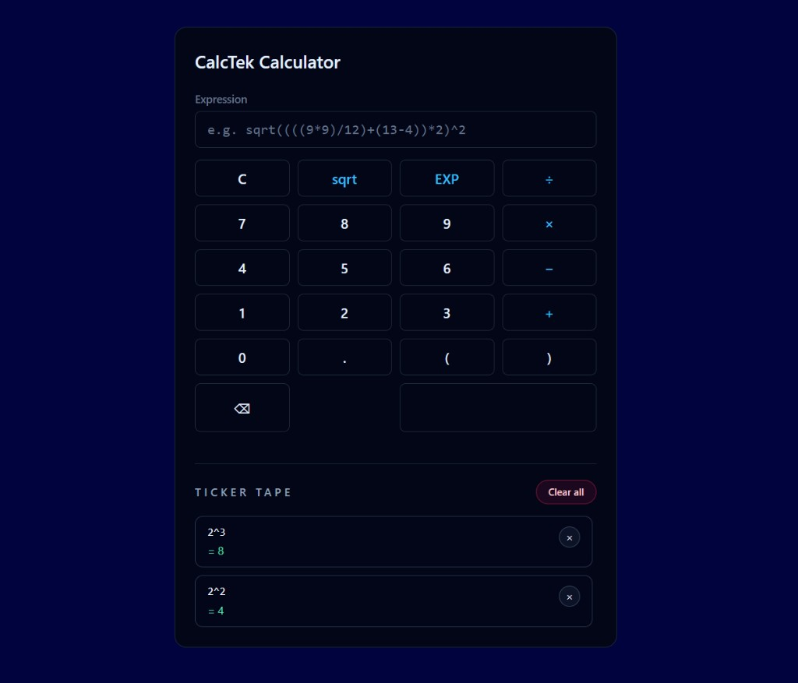

## CalcTek API Calculator

API-driven scientific calculator built with **Laravel 12** and **Vue 3**, featuring:

- Expression-based calculations powered by a safe PHP math-expression library.
- Per-session ticker-tape history with delete and clear-all actions.
- A modern, keyboard-and-click friendly calculator UI built with Tailwind CSS.

### UI preview



## Running the test suite

To run all tests:

```bash
php artisan test
```

To run only the calculator API tests:

```bash
php artisan test --filter=CalculationApiTest
```

### Tests created for this project

The main feature tests live in `tests/Feature/CalculationApiTest.php` and cover:

- **`test_creates_and_returns_simple_calculation`**  
  Verifies that posting a simple expression like `1+2*3`:
  - returns `201 Created`,
  - evaluates to the correct result (`7`),
  - persists the calculation in the database with the correct session token.

- **`test_filters_history_by_session`**  
  Ensures that the ticker-tape history endpoint:
  - only returns calculations for the current session (keyed by `X-Calculator-Session`),
  - does not leak calculations from other sessions.

- **`test_complex_expression_evaluates_correctly`**  
  Confirms that the math library correctly evaluates the stretch-goal expression:
  - `sqrt((((9*9)/12)+(13-4))*2)^2`  
  and returns the expected numeric result (within a small delta).

- **`test_division_by_zero_sets_error`**  
  Validates error-handling behaviour:
  - expressions like `1/0` are accepted and stored,
  - the record is marked with `had_error = true`,
  - the API response reflects that an error occurred instead of throwing a server error.

- **`test_php_like_injection_expression_is_flagged_as_error`**  
  Uses an intentionally unsafe-looking string (`1 + 2; system('cat /etc/passwd');`) to prove that:
  - the evaluator treats it as invalid math and never executes it as PHP,
  - the calculation is stored with `had_error = true` and no `result`,
  - the API response remains a normal `201` with an error flag instead of a crash.

- **`test_very_deeply_nested_expression_is_treated_as_too_complex`**  
  Sends an expression with nesting deeper than the configured limit to ensure:
  - the complexity guard in `ExpressionEvaluator` detects excessive parenthesis depth,
  - the expression is recorded as an error (`had_error = true`) instead of attempting evaluation.

- **`test_expression_with_too_many_operators_is_treated_as_too_complex`**  
  Sends an expression containing more operators than allowed (e.g. `1+1+1+...`) and verifies:
  - the request is accepted and stored,
  - `had_error = true` is set due to complexity,
  - preventing CPU-heavy expressions from being evaluated.

- **`test_rate_limiting_on_calculation_creation`**  
  Exercises the `throttle:30,1` middleware by:
  - sending 30 valid requests and confirming they succeed,
  - asserting that the 31st request is rejected with `429 Too Many Requests`.

- **`test_xss_like_expression_is_stored_verbatim_and_treated_as_data`**  
  Posts an expression such as `<script>alert('xss')</script>` and asserts that:
  - the expression is stored and returned **verbatim** in JSON,
  - the backend treats it purely as data (no transformation or execution), relying on Vue's default HTML escaping on the frontend.

- **`test_requires_session_header`**  
  Asserts that all calculator endpoints require a per-session token:
  - requests without `X-Calculator-Session` are rejected with `400 Bad Request`,
  - preventing anonymous/unguarded access to shared calculation history.

These tests were created to validate:

- Correct expression evaluation for both simple and complex inputs.
- Isolation of history per user session.
- Robust error handling instead of crashes for invalid or malicious input (e.g. division by zero, code-like strings).
- Protection against obviously abusive expressions via depth/operator limits.
- Correct behaviour of rate limiting and storage of untrusted-but-escaped data such as HTML-like input.
- API contract expectations that the Vue frontend relies on.

---

## Implementation notes

- **Expression evaluation**  
  The backend uses [`nxp/math-executor`](https://github.com/neonxp/MathExecutor) instead of `eval` to safely parse and evaluate expressions containing:
  - `+ - * /` arithmetic,
  - parentheses,
  - functions like `sqrt`,
  - exponentiation via `^`.

- **Session isolation**  
  Every request must include an `X-Calculator-Session` header. The backend:
  - stores this token with each calculation,
  - filters history by it,
  - refuses requests that don't provide it.
  The Vue frontend generates and persists this token in `localStorage`.

- **Frontend stack**  
  - Vue 3 single-file components (`CalculatorApp.vue`, `TickerTape.vue`),
  - Tailwind CSS via the `@tailwindcss/vite` plugin,
  - Axios for talking to the Laravel API.

---

## License

This project is open-sourced software licensed under the [MIT license](https://opensource.org/licenses/MIT).
